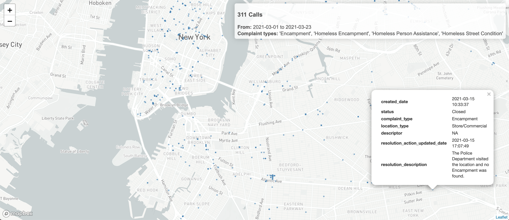

# StopTheSweepsNYC Coalition - 311 Call Map

Map of 311 calls built for the StopTheSweepsNYC Coalition.

**[See the map!](https://austensen.github.io/stopthesweepsnyc/311-map.html)**

## Installation

You'll need to download and install both [R](https://cloud.r-project.org/) and [RStudio](https://rstudio.com/products/rstudio/download/#download).

This project uses [`renv`](https://rstudio.github.io/renv/articles/renv.html) to handle dependency management. To get this project set up on your own system, open the project in RStudio (and open the `.Rproj` file), install `renv` (`install.packages("renv")`), and run `renv::init()`. 

## Environment variables

Edit `.env_sample` to fill in the variables and save it as `.env`. 

Currently the only variable used is for MapboxGL to have a nicer basemap. You can sign up for a [free Mapbox API key](https://account.mapbox.com/auth/signup/).

## Data

All the data for this map is from [NYC Open Data 311 Service Requests](https://data.cityofnewyork.us/Social-Services/311-Service-Requests-from-2010-to-Present/erm2-nwe9), accessed via the free API.
